# Relatório de casos de teste — explícito vs. semi-Lagrangeano

Comparação dos 3 casos de validação rodados (Poiseuille, degrau/backward-facing
step e cavidade lid-driven), cada um nas duas formulações de advecção
disponíveis (`simulation.advection: eulerian` e `semi_lagrangian`), com dados
extraídos de `solucoes/benchmarks.xlsx` (ver `docs/benchmark.md` para o
significado de cada coluna) e imagens de `docs/imagens/`. Em cada dupla, o
`eulerian` e o `semi_lagrangian` usaram a mesma malha, `dt`, `Re` e número de
iterações — só o termo advectivo muda.

Não são avaliadas aqui as métricas de convergência do BiCGSTAB
(`bicg_iters_*`, `bicg_residual_*`, `passos_nao_convergidos`).

---

## 1. Poiseuille (escoamento entre placas)

**Malha** (`meshes/poiseuille.msh`): 2785 nós, 5376 elementos.
**Config**: `dt = 0.001`, `Re = 1`, 1000 iterações, `device = cuda`.

| Métrica | `eulerian` | `semi_lagrangian` |
|---|---|---|
| Tempo total (s) | 47.830 | 38.664 |
| Tempo médio/iter (s) | 0.04687 | 0.03773 |
| `vel_l2_media` | 1.039511 | 1.039477 |
| `vel_l2_max` | 1.040303 | 1.040267 |
| `vel_linf_max` | 1.453985 | 1.453849 |
| `divergencia_l2_media` | 1.1203e-06 | 1.1235e-06 |
| `divergencia_l2_max` | 7.2144e-06 | 7.2144e-06 |
| `pressao_min` (último passo) | 0 | 0 |
| `pressao_max` (último passo) | 89.908 | 90.061 |
| `pressao_media` (último passo) | 12.069 | 12.085 |

### Perfil (p, vx, vy) ao longo da linha de saída

| `eulerian` | `semi_lagrangian` |
|---|---|
| 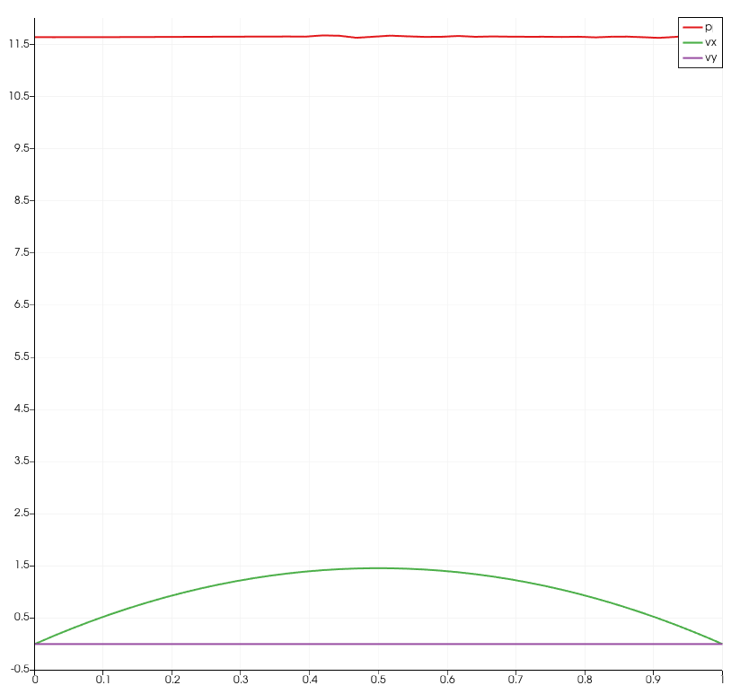 | 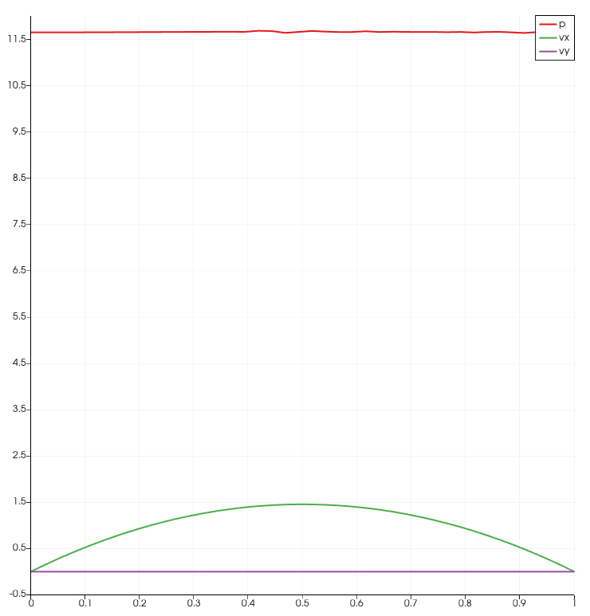 |

### Campos 2D

| Campo | `eulerian` | `semi_lagrangian` |
|---|---|---|
| `vx` | 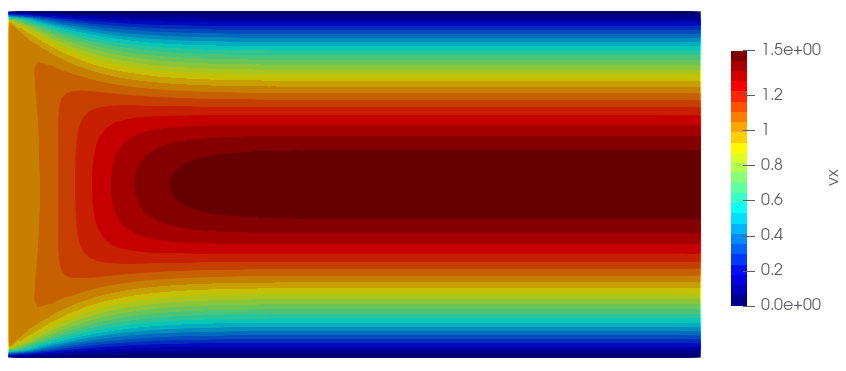 | 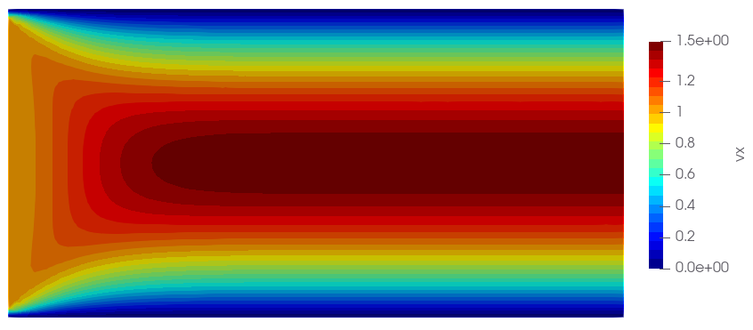 |
| `vy` | 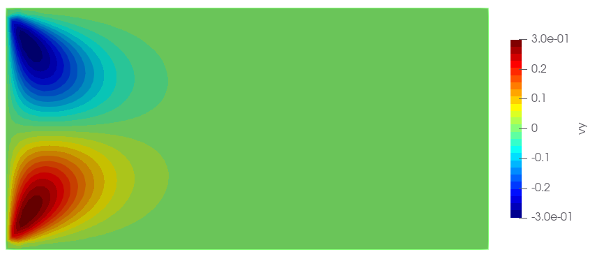 | 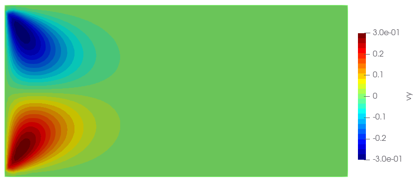 |
| `p` | 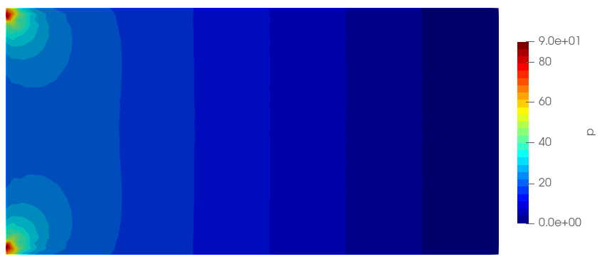 | 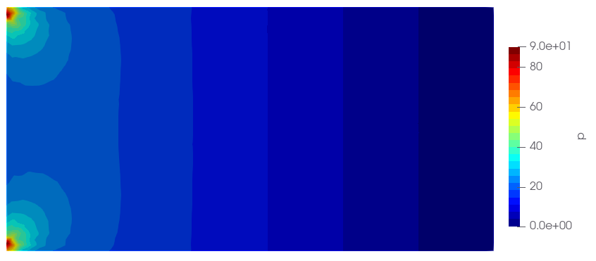 |

---

## 2. Degrau (backward-facing step)

**Malha** (`meshes/degrau.msh`): 4497 nós, 8704 elementos.
**Config**: `dt = 0.01`, `Re = 1`, 1000 iterações, `device = cuda`.

| Métrica | `eulerian` | `semi_lagrangian` |
|---|---|---|
| Tempo total (s) | 78.875 | 49.895 |
| Tempo médio/iter (s) | 0.07799 | 0.04896 |
| `vel_l2_media` | 0.614699 | 0.614662 |
| `vel_l2_max` | 0.614877 | 0.614840 |
| `vel_linf_max` | 1.398297 | 1.397695 |
| `divergencia_l2_media` | 7.5339e-07 | 7.5529e-07 |
| `divergencia_l2_max` | 3.7056e-06 | 3.7056e-06 |
| `pressao_min` (último passo) | -2.605 | -2.634 |
| `pressao_max` (último passo) | 57.032 | 57.264 |
| `pressao_media` (último passo) | 5.977 | 5.991 |

### Perfil (p, vx, vy) ao longo da linha de saída

| `eulerian` | `semi_lagrangian` |
|---|---|
| 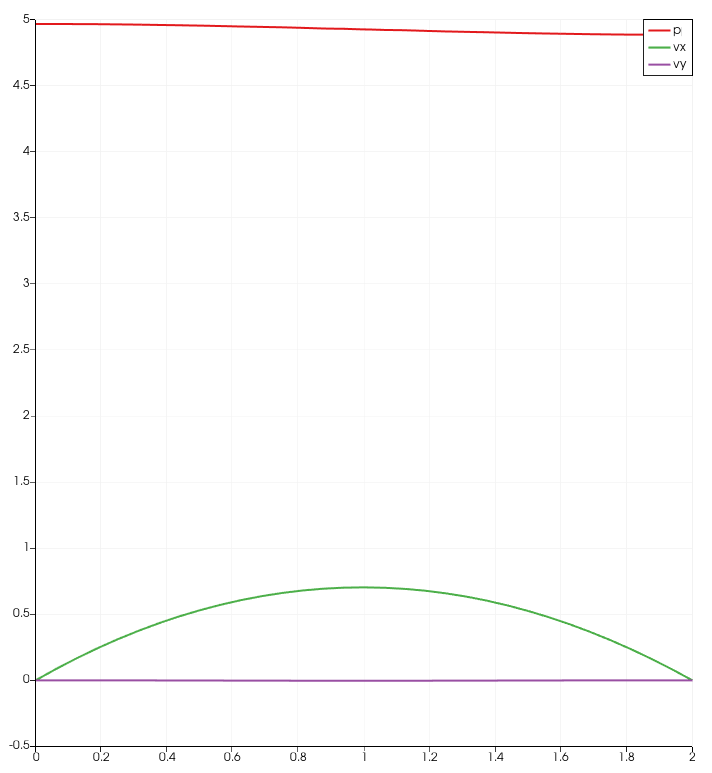 | 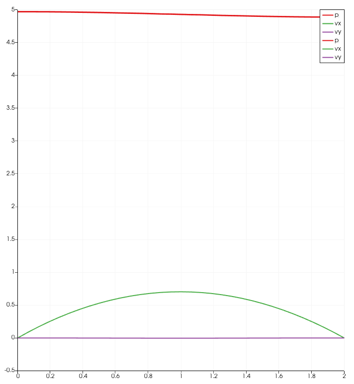 |

### Campos 2D

| Campo | `eulerian` | `semi_lagrangian` |
|---|---|---|
| `vx` | 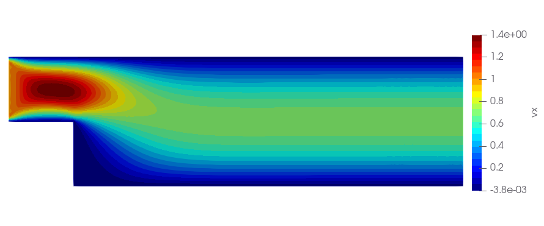 | 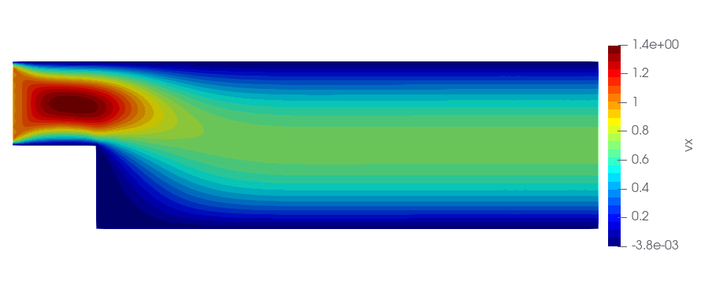 |
| `vy` | 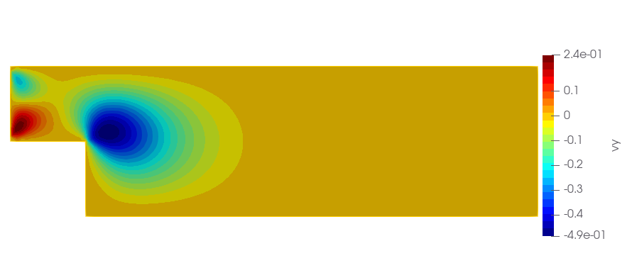 | 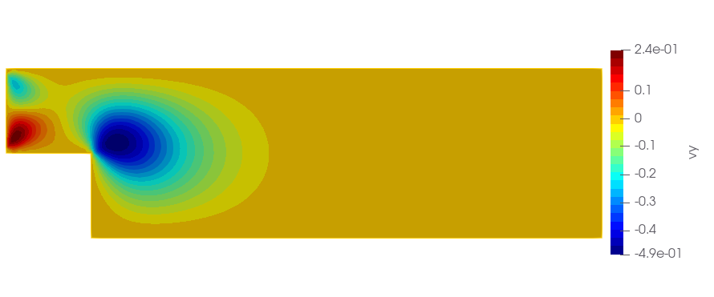 |
| `p` | 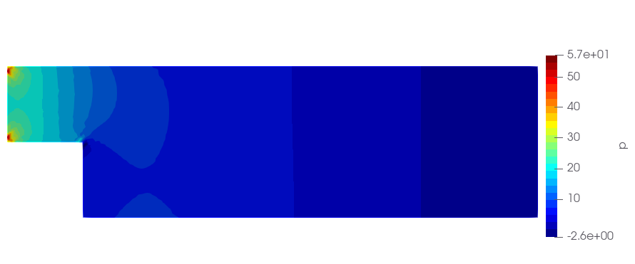 | 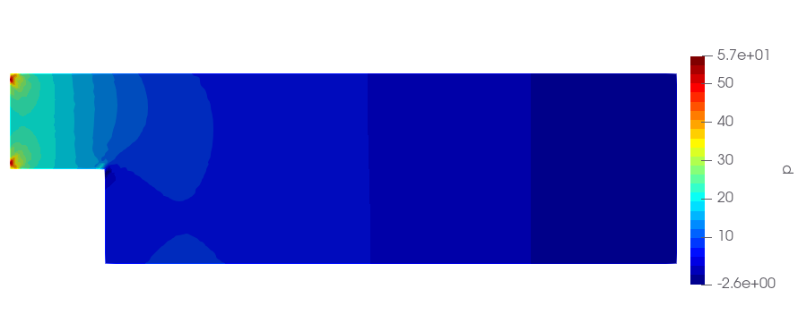 |

---

## 3. Cavidade lid-driven

**Malha** (`meshes/lid.msh`): 8321 nós, 16384 elementos.
**Config**: `dt = 0.01`, `Re = 1`, 1000 iterações, `device = cuda`.

| Métrica | `eulerian` | `semi_lagrangian` |
|---|---|---|
| Tempo total (s) | 136.483 | 33.632 |
| Tempo médio/iter (s) | 0.1319 | 0.03258 |
| `vel_l2_media` | 0.261512 | 0.261500 |
| `vel_l2_max` | 0.261675 | 0.261662 |
| `vel_linf_max` | 1 | 1 |
| `divergencia_l2_media` | 2.4280e-09 | 1.9062e-09 |
| `divergencia_l2_max` | 2.3783e-06 | 1.6542e-06 |
| `pressao_min` (último passo) | -163.060 | -163.115 |
| `pressao_max` (último passo) | 163.089 | 163.123 |
| `pressao_media` (último passo) | -0.352 | -0.352 |

### Perfil (p, vx, vy) ao longo da linha central

| `eulerian` | `semi_lagrangian` |
|---|---|
|  | 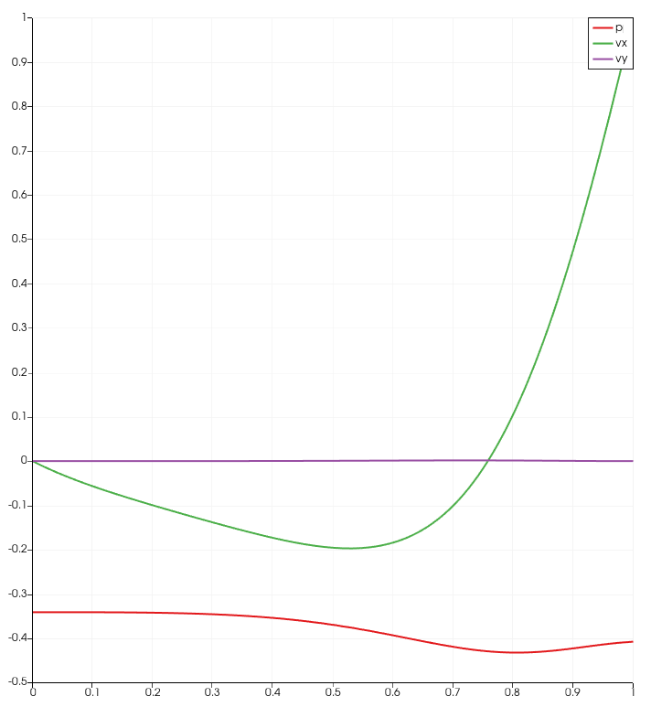 |

### Campos 2D

| Campo | `eulerian` | `semi_lagrangian` |
|---|---|---|
| `vx` |  | 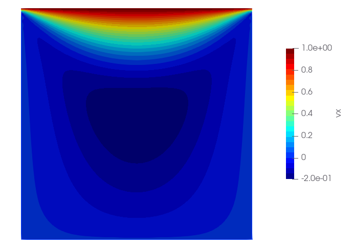 |
| `vy` | 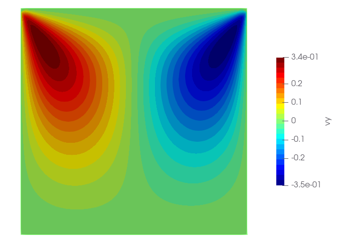 |  |
| `p` | 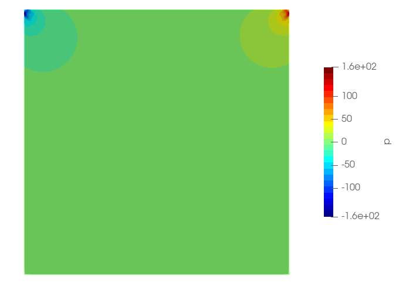 |  |
